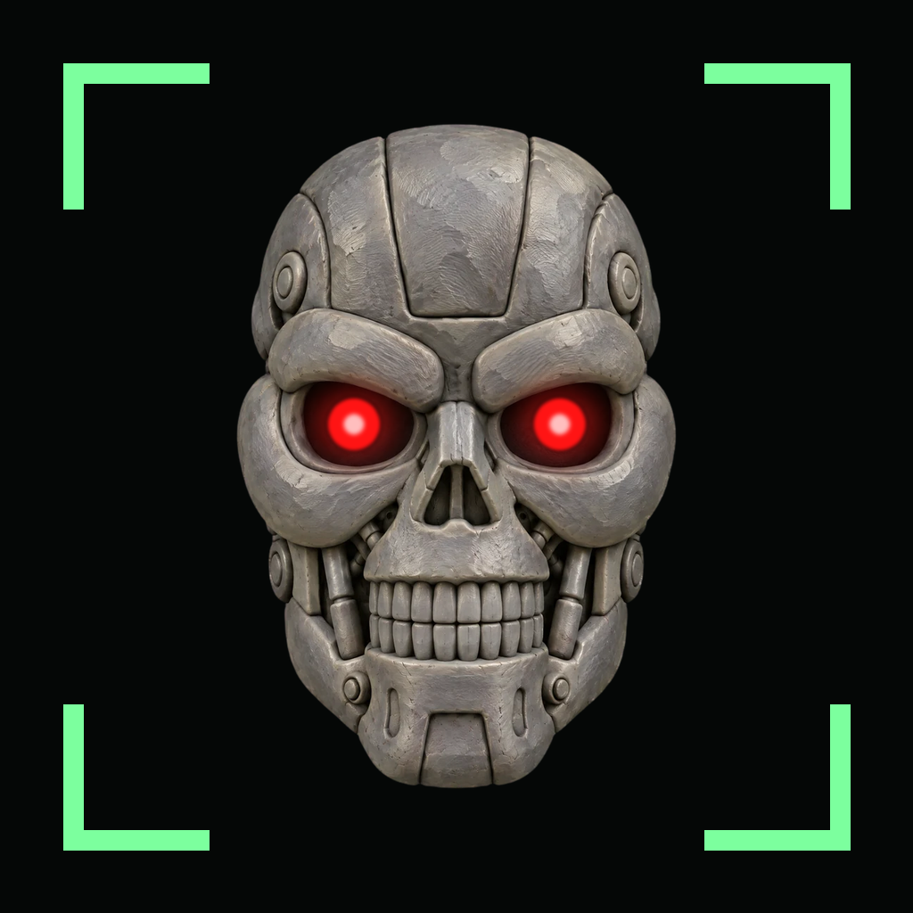

<p align="center">
  
</p>

<h1 align="center">Sandbox IA</h1>

<p align="center">
  <strong>La IA se me fue de control. ¿Me ayudás a contenerla?</strong><br>
  Juego de reflejos con un panel de datos en vivo, donde toda la estadística se calcula en SQL.
</p>

<p align="center">
  <a href="https://sandboxia.html-5.me/"><strong>▶ Jugar</strong></a> ·
  <a href="https://sandboxia.html-5.me/estadisticas.html"><strong>📊 Ver los datos en vivo</strong></a>
</p>

---

## De qué se trata

Una IA está intentando escaparse de su *sandbox*. Hay seis botones verdes y, cuando uno se pone rojo, tenés que apretarlo lo más rápido posible. Si tardás, apretás antes de tiempo o caés en un botón señuelo, la barra de **descontrol** sube. Si llega al 100 %, la IA escapa.

Cada partida tiene 12 rondas y se juega desde la compu o el celular. Al terminar, el juego te dice qué tan rápido reaccionaste comparado con el resto de los operadores.

Pero el juego es la excusa: cada reacción se guarda en la base de datos y alimenta un **panel de estadísticas en vivo** que responde preguntas como:

- ¿Cuánto tardamos en reaccionar? ¿Qué tan dispersos son los tiempos?
- ¿Se reacciona más rápido desde el celular o desde la compu?
- ¿Hay algún botón donde la gente sea más lenta?
- ¿Cómo cambia el rendimiento a lo largo de la partida?
- ¿La IA se escapa más con un robot que con el otro?

## Lo interesante por dentro

### Un experimento A/B con dos robots

Al empezar cada partida, el servidor sortea contra qué robot vas a jugar, y el navegador nunca se entera de cuál le tocó (si lo supieras, podrías cambiar tu forma de jugar y los grupos dejarían de ser comparables).

| | Robot aleatorio (grupo de control) | Robot adaptativo |
|---|---|---|
| **Qué botón elige** | Al azar | Tu botón más lento, según tu historial |
| **Cuánto tiempo te da** | Ventana fija: de 1000 ms a 440 ms a lo largo de la partida | Según tu mediana: de 2,0× a 1,3× |
| **Botones señuelo** | 15 % de las rondas, siempre igual | Del 10 % al 45 %, cada vez más traicionero |

El adaptativo "aprende" de vos sin machine learning: usa tu media por botón y tu mediana de reacción, calculadas en SQL. Además tiene una **temperatura** que sube del 0,20 al 0,90 durante la partida: es la probabilidad de que ignore su estrategia y elija al azar, para que no sea predecible.

### Aleatoriedad reproducible

Cada partida tiene una **semilla** y un generador pseudoaleatorio propio (Lehmer, módulo 2³¹ − 1 y multiplicador 48271). Con la semilla guardada en la base se puede reconstruir cualquier ronda de cualquier partida.

- El tiempo de espera hasta el rojo sigue una **distribución exponencial** (600 ms + exponencial de media 900 ms, con tope en 3 s). Es una distribución *sin memoria*: haber esperado mucho no da ninguna pista de cuándo llega el rojo, así que es imposible anticiparse.
- Cada ronda consume siempre la misma cantidad de sorteos, use o no el señuelo, para que la ronda *N* caiga en la misma posición de la secuencia sea cual sea el robot.

### El servidor no le cree al navegador

Todo lo que decide la partida vive en el servidor, en la sesión de PHP: la semilla, el robot, las reglas y la barra de descontrol. El navegador solo dibuja, mide el tiempo y avisa qué pasó.

- Una reacción de menos de **100 ms** queda marcada como sospechosa: ningún humano reacciona tan rápido a un estímulo visual. El dato se conserva, pero las estadísticas lo excluyen.
- El servidor mide por su cuenta cuánto tardó en llegar cada respuesta. Si el tiempo declarado por el navegador no entra en ese tiempo real, la partida se anula.
- El navegador no puede pedir una ronda que no le toca, repetir una ya respondida ni elegir robot.
- Un tope global de partidas nuevas cada 10 minutos frena a un script que intente llenar la base.

### Toda la estadística se calcula en SQL

PHP solo ejecuta consultas y el JavaScript del panel solo dibuja. Las medianas, los percentiles y las pruebas de hipótesis se resuelven en la base con `WITH` y funciones de ventana (`ROW_NUMBER() OVER`, `COUNT(*) OVER`, `SUM() OVER`):

- **Distribución de tiempos:** mejor, peor, media, desvío, percentil 10, mediana y percentil 90, por dispositivo y por robot, en una sola consulta.
- **PC contra celular:** prueba *z* de Welch sobre las medias. Exige al menos 30 reacciones **y 5 personas distintas** por lado: si en PC jugara una sola persona y en celular otra, la "diferencia de dispositivo" sería en realidad la diferencia entre esas dos personas.
- **Mapa de calor de los botones:** cada botón contra "todos los demás", con el resto calculado como `SUM() OVER ()` menos el propio botón. Solo con el robot aleatorio, porque el adaptativo ataca tu botón más lento y mezclaría la posición con su estrategia.
- **Duelo entre robots:** prueba de dos proporciones sobre el porcentaje de partidas en que la IA escapa.
- **Veredictos exigentes:** una diferencia se anuncia solo con |z| ≥ 3 y datos suficientes. Las reacciones de una misma persona no son independientes (eso infla el *z*), y en el mapa de calor se hacen seis comparaciones a la vez, así que el panel prefiere decir "todavía no alcanza" antes que anunciar una casualidad.

Criterio para las partidas abandonadas: las métricas de **tiempo** usan todas las reacciones válidas, termine o no la partida; las métricas de **resultado** (porcentaje de fuga, duelo) usan solo partidas terminadas, porque una partida sin terminar no tiene resultado.

### Por qué no hay vistas ni procedimientos

La primera versión resolvía la estadística con 26 vistas apiladas y un procedimiento almacenado con un cursor, porque MariaDB 10.1 no tenía funciones de ventana. Al publicarlo, el hosting gratuito no permitía `CREATE VIEW` ni procedimientos. Se migró todo a consultas `SELECT` con `WITH` y funciones de ventana, una consulta por vez, verificando cada una contra la vista original con `EXCEPT` en ambos sentidos hasta obtener 0 diferencias. El resultado es más simple de instalar: la base tiene solo tres tablas.

### Programación orientada a objetos

El backend está organizado en clases con una responsabilidad cada una (`ServicioPartida`, `ReglasPartida`, `Robot` y sus dos hijos, `GeneradorAleatorio`, y dos repositorios). El código tiene comentarios que señalan dónde y por qué se aplica cada uno de los cuatro pilares: **abstracción**, **encapsulamiento**, **herencia** y **polimorfismo**. Por ejemplo, `Robot` es una clase abstracta y `ServicioPartida` recibe una lista de robots sin saber cómo es cada uno: agregar un tercer robot no requiere tocar el servicio.

## Tecnologías

- **Backend:** PHP (compatible desde 5.6) con mysqli y sentencias preparadas.
- **Base de datos:** MariaDB 10.2 o superior, o MySQL 8 (usa `WITH` y funciones de ventana).
- **Frontend:** HTML, CSS y JavaScript sin frameworks. Los gráficos del panel son SVG dibujados a mano, y los sonidos se sintetizan con la Web Audio API.
- **Hosting:** InfinityFree.

## Estructura

```
├── index.html              El juego
├── estadisticas.html       El panel de datos en vivo
├── tablas_juego.sql        Las tres tablas: jugadores, partidas y rondas
├── api/
│   ├── iniciar_partida.php    POST: crea la partida y entrega la ronda 1
│   ├── registrar_ronda.php    POST: valida la ronda y entrega la siguiente
│   └── estadisticas.php       GET: todo lo que dibuja el panel (con caché de 10 s)
├── clases/                 Lógica del juego y consultas SQL
├── config/
│   └── conexion.ejemplo.php
├── css/
├── js/
└── img/
```

## Instalación local

1. Cloná el repositorio dentro de la carpeta del servidor web (por ejemplo, `htdocs` en XAMPP).
2. Creá la base de datos:
   ```sql
   CREATE DATABASE sandbox_ia CHARACTER SET utf8mb4 COLLATE utf8mb4_unicode_ci;
   ```
3. Con la base seleccionada, importá `tablas_juego.sql`.
4. Copiá `config/conexion.ejemplo.php` como `config/conexion.php` y completá tus datos de conexión. Ese archivo está en `.gitignore`: tus credenciales nunca llegan al repositorio.
5. Abrí `http://localhost/<carpeta>/` y jugá.

## Sobre los datos del panel

El panel arrancó con partidas simuladas para no mostrarse vacío el primer día. No se inventaron a mano: se generaron con las mismas clases del juego (robots, reglas y generador aleatorio), así que cada ronda es exactamente la que produciría el servidor con esa semilla. Los jugadores simulados reaccionan más lento que un jugador atento y están repartidos por igual entre PC y celular, para no fabricar diferencias: las conclusiones del panel las deciden los jugadores reales. Están marcados en la base y se pueden quitar en cualquier momento.

## Autor

**Martín Carossino**: desarrollador backend en transición hacia el análisis de datos.

[Portfolio](https://martincarossino.github.io/) · [LinkedIn](https://www.linkedin.com/in/martincarossino/) · [GitHub](https://github.com/MartinCarossino)
